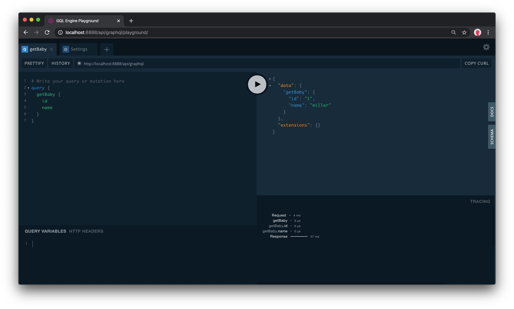

#Embedded Playground for Gopher graphql apps



# Usage

```go
go get -u github.com/gqlengine/playground
```


#Example

```go
package main

import (
	"net/http"

	"github.com/gorilla/mux"
	"github.com/gqlengine/playground"
	"github.com/gqlengine/gqlengine"
)

type ID int

func (id ID) GraphQLID() {}

type Gender int

func (g Gender) GraphQLEnumDescription() string {
	return "baby gender"
}

func (g Gender) GraphQLEnumValues() gqlengine.EnumValueMapping {
	return gqlengine.EnumValueMapping{
		"Female": {Female, "female"},
		"Male":   {Male, "male"},
	}
}

const (
	Female Gender = 0
	Male   Gender = 1
)

type Baby struct {
	ID     ID     `json:"id" gqlDesc:"ID"`
	Name   string `json:"name" gqlDesc:"Name"`
	Gender Gender `json:"gender"`
}

func (b *Baby) GraphQLArguments() {}

func (b *Baby) GraphQLObjectDescription() string {
	return "baby object"
}

func main() {
	app := gqlengine.NewEngine(gqlengine.Options{
		Tracing: true,
	})
	err := app.AddQuery("getBaby", "get baby", func() (*Baby, error) {
		return &Baby{
			ID:     ID(1),
			Name:   "miller",
			Gender: Male,
		}, nil
	})
	if err != nil {
		panic(err)
	}
	app.AddMutation("addBaby", "add baby", func(*Baby) error {
		return nil
	})

	app.AddPaginationQuery("getBabies", "get babies", func(pagination *gqlengine.Pagination) ([]*Baby, error) {
		return nil, nil
	}, func() (int, error) {
		return 0, nil
	})

	err = app.Init()
	if err != nil {
		panic(err)
	}

	playground.SetEndpoints("/api/graphql", "")

	r := mux.NewRouter()
	r.HandleFunc("/api/graphql", app.ServeHTTP)
	r.PathPrefix("/api/graphql/playground").
		Handler(http.StripPrefix("/api/graphql/playground", http.FileServer(playground.WebBundle)))

	err = http.ListenAndServe(":8000", r)
	if err != nil {
		panic(err)
	}
}
```

open browser at `http://localhost:8000/api/graphql/playground`

